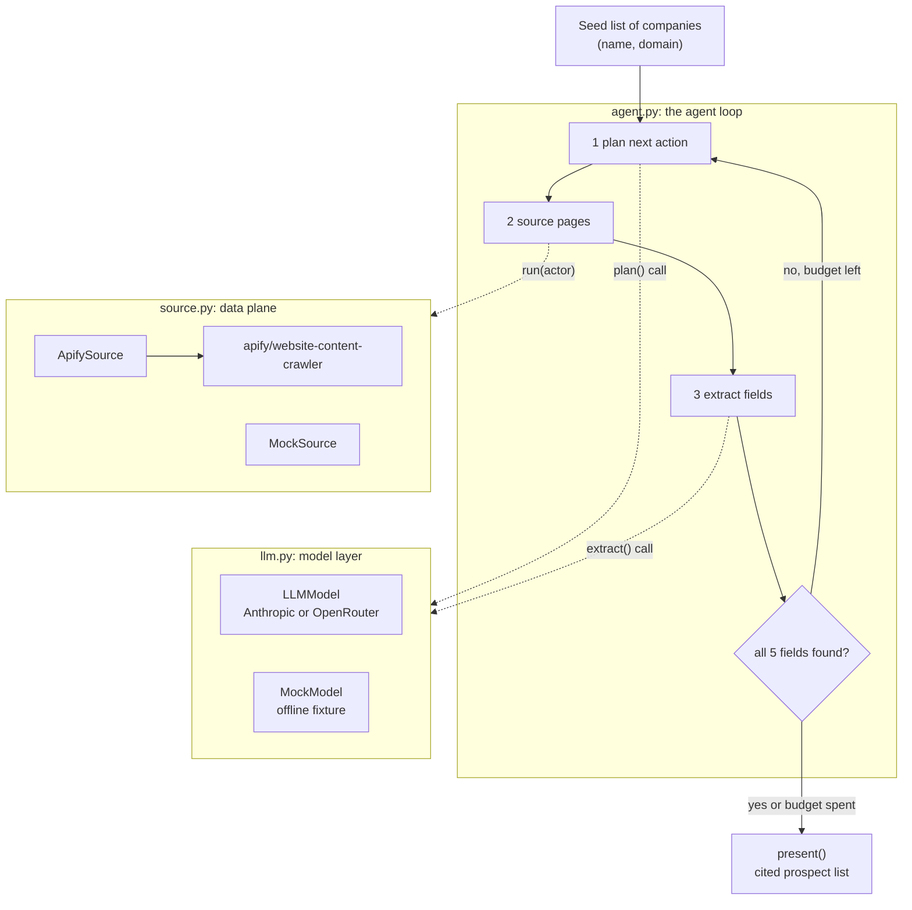
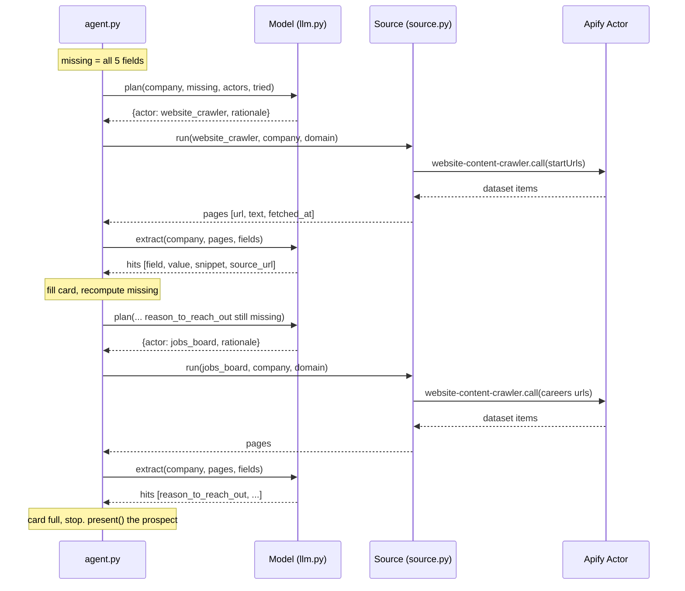
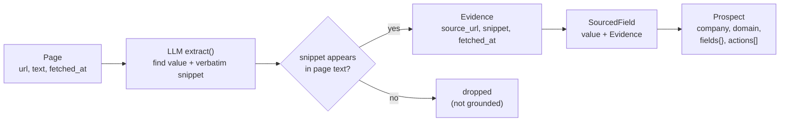

# Architecture and learning guide, module 1

This document explains how the module 1 sourcing agent works end to end: the
agent loop, the tools it calls, the LLM calls it makes, and the data that flows
between them. It is written to be read alongside the code. Every claim here
points at a real file you can open.

If you only read one thing: the agent turns a list of company names into a list
of prospect cards where every field carries the source it came from. It does
this by alternating between two kinds of work, thinking (LLM calls) and acting
(tool calls), until each card is full.

Contents:

1. [The mental model](#1-the-mental-model)
2. [System architecture](#2-system-architecture)
3. [The agent loop, step by step](#3-the-agent-loop-step-by-step)
4. [The model layer and the two LLM calls](#4-the-model-layer-and-the-two-llm-calls)
5. [The data plane and its tools](#5-the-data-plane-and-its-tools)
6. [The data model: evidence is the spine](#6-the-data-model-evidence-is-the-spine)
7. [The output](#7-the-output)
8. [Live versus offline](#8-live-versus-offline)
9. [Failure modes and design choices](#9-failure-modes-and-design-choices)
10. [Where module 2 picks up](#10-where-module-2-picks-up)
11. [Glossary](#11-glossary)

---

## 1. The mental model

A pipeline is a fixed sequence of steps: do A, then B, then C. An agent is
different. It has a goal, a set of tools, and it decides at each step which tool
to use next based on what it has so far. It loops until the goal is met or it
runs out of budget.

This agent's goal, per company, is to fill a prospect card with five fields. Its
tools are Apify Actors that fetch web pages. Its judgment comes from an LLM. The
loop is: look at what is still missing, pick a tool to go find it, run the tool,
read the results, repeat.

The difference matters. A pipeline that only crawls the company website would
miss a hiring signal that lives on a jobs board. The agent notices the gap and
goes to a second source on its own. You will see exactly this happen with the
company Quantal in the sample run.

Two ideas hold the design together:

- **Think and act are separate.** Thinking is an LLM call (`llm.py`). Acting is a
  tool call (`source.py`). The agent in `agent.py` only orchestrates; it holds no
  intelligence and no network code of its own.
- **Evidence is mandatory.** A value with no source is dropped, never guessed.
  This is the one rule module 1 keeps, and it is what makes the output auditable.

---

## 2. System architecture



Three layers, each in its own file:

| Layer | File | Job |
|-------|------|-----|
| Orchestration | `agent.py` | Run the loop, hold the prospect card, decide when to stop |
| Model | `llm.py` | Make the two LLM calls: plan and extract |
| Data plane | `source.py` | Run Apify Actors and return pages |

Each layer has a live implementation and an offline one behind the same
interface. The agent does not know or care which it is talking to. That is why
`python agent.py` runs with no keys and `python agent.py --live` hits real APIs
with zero change to the loop.

---

## 3. The agent loop, step by step

The loop lives in `work_company()` in `agent.py`. It runs once per company and
repeats up to `MAX_ACTIONS` times (3 by default).



One pass through the loop:

1. **Compute the gap.** `missing = [name for name, _ in FIELDS if name not in prospect.fields]`.
   If nothing is missing, stop early. This is what makes the agent efficient: a
   company whose website answers everything takes one action, not three.

2. **Plan (LLM call).** `model.plan(company, domain, missing, ACTORS, tried)`
   returns which Actor to run next, or `stop`. It is told the open gaps and which
   Actors were already tried, so it does not repeat itself or chase a closed gap.

3. **Guard the plan.** If the planner names an unknown Actor or one already
   tried, the agent stops rather than loop forever. Cheap defense against a bad
   model response.

4. **Source (tool call).** `source.run(actor, company, domain)` runs the Actor
   and returns a list of pages, each `{url, text, fetched_at}`.

5. **Extract (LLM call).** `model.extract(company, pages, FIELDS)` reads the pages
   and returns hits, one per field it can support with a verbatim snippet.

6. **Fill the card.** `prospect.fields.setdefault(field, SourcedField(...))`. The
   `setdefault` means the first source to supply a field wins; later actions only
   fill fields that are still empty.

7. **Loop.** Recompute the gap and go again, until the card is full or the budget
   is spent.

The budget (`MAX_ACTIONS = 3`) is the backstop. Without it, a company the agent
can never fully source would loop forever. With it, the agent does its best
within a bounded number of tool calls and moves on, leaving any unfilled field
blank. Blank is honest. A guess is not.

---

## 4. The model layer and the two LLM calls

All model work goes through the `Model` interface in `llm.py`, which has exactly
two methods. Keeping the surface this small is deliberate: it is the entire
contract between the agent's judgment and everything else.

```python
class Model:
    def plan(self, company, domain, gaps, actors, tried) -> dict: ...
    def extract(self, company, pages, fields) -> list[dict]: ...
```

### 4.1 The plan call

Purpose: decide the single next tool to run, given what is missing.

The system prompt fixes the model's role and pins the output shape:

```
You plan one sourcing step for a B2B sales-research agent.
Pick the single Actor most likely to fill an open gap, or stop.
Reply with strict JSON: {"actor": <name or 'stop'>, "rationale": <str>}.
```

The user message is built fresh each turn from live state: the company, the open
gaps, the Actors already tried, and the Actor catalog with descriptions. The
model returns one JSON object naming the Actor and a short rationale. The
rationale is not decoration; it is logged into `prospect.actions` so the run is
explainable after the fact.

Why an LLM for this at all, when a hard-coded order would work for four
companies? Because real targets are messy. One company puts hiring on its
homepage, another on a careers subdomain, another only on a third-party board.
The planner reasons about which source is likely to carry the missing signal
instead of marching through a fixed list. The Actor catalog is data, so adding a
new Actor (press releases, LinkedIn, funding databases) needs no change to the
planning logic; the model simply starts choosing it.

### 4.2 The extract call

Purpose: turn raw page text into structured fields, each with the exact snippet
that backs it.

The system prompt is where the evidence rule is enforced:

```
You extract structured fields from crawled web pages for a sales rubric.
For each field you can support, return the value and the exact verbatim
snippet from the page that backs it. Never invent a value. If a field is not
supported by the pages, omit it. Reply with strict JSON: a list of objects
with keys field, value, snippet, source_url, fetched_at.
```

The user message carries the field specs and the pages as JSON. The model
returns a list of extractions. Then `llm.py` does something most extraction code
skips: it **grounds** every result.

```python
page = next((p for p in pages if p["url"] == source_url), None)
if not page or not snippet or snippet not in page["text"]:
    continue  # drop it: the snippet is not actually on the cited page
```

If the model returns a snippet that does not appear verbatim on the page it
cited, that extraction is thrown away. This is the code-level guarantee behind
"plausible is not verified." The model can be confident and wrong; the grounding
check cannot be talked into a citation that does not exist. A field that fails
grounding simply stays missing, and the loop may try another source for it.

### 4.3 How the call is actually made

`LLMModel._chat()` sends one system message and one user message and returns the
text. Two providers, picked by which key is set:

- **Anthropic**: `anthropic.Anthropic().messages.create(model, max_tokens=2000, system=..., messages=[...])`.
  Default model `claude-sonnet-5`, overridable with the `MODEL` env var.
- **OpenRouter**: a POST to `https://openrouter.ai/api/v1/chat/completions` with
  the system and user messages. Default model `anthropic/claude-sonnet-5`.

Both imports are lazy, done inside the method, so the offline path never needs
these packages installed. Structured output is handled simply: the model is told
to reply with strict JSON, and `_strip_fences()` removes any Markdown code fence
before `json.loads()`. If parsing fails, `plan` returns `stop` and `extract`
returns an empty list, so a malformed model response degrades safely instead of
crashing the run.

### 4.4 The mock model

`MockModel` implements the same two methods with no network. `plan` follows a
fixed order (website first, then the jobs board if a reason is still missing,
then stop). `extract` reads an `extractable` list baked into each fixture page,
where every snippet is already a verbatim substring of that page's text. This
lets the entire loop, including the grounding logic, run and be verified offline.
The mock stands in for the model's judgment; the trust-bearing parts of the
pipeline are exercised for real.

---

## 5. The data plane and its tools

Apify is the data plane. The agent's tools are Apify Actors, exposed through
`source.py`. The catalog the planner chooses from is just a dictionary:

```python
ACTORS = {
    "website_crawler": "crawl the company domain (home, about, team, blog) for first-pass signals",
    "jobs_board": "look for hiring pages, a common reason-to-reach-out signal",
}
```

`ApifySource.run(actor, company, domain)` maps an Actor name to a real crawl:

- `website_crawler` crawls `https://{domain}` up to 6 pages.
- `jobs_board` crawls `https://{domain}/careers` and `/jobs` up to 4 pages.

Both call the same underlying Apify Actor, `apify/website-content-crawler`, with
different start URLs and page limits. The call pattern is the standard Apify SDK
shape:

```python
run = self.client.actor("apify/website-content-crawler").call(run_input={...})
for item in self.client.dataset(run["defaultDatasetId"]).iterate_items():
    pages.append({"url": item["url"], "text": item["text"], "fetched_at": fetched})
```

`actor(...).call(...)` starts the Actor and blocks until the run finishes. The
results land in a dataset, which the SDK paginates through with
`iterate_items()`. Each item becomes one page. Note `fetched_at` is stamped at
crawl time and carried on every page; module 1 does not use it, but it is the
raw material the module 2 freshness check will need.

A page is the unit that crosses from the data plane to the model: `{url, text,
fetched_at}`. The crawler returns readable text, not raw HTML, which is what
makes the extract call practical and cheap.

`MockSource` returns the same page shape from `fixtures/crawl_pages.json` instead
of the network, keyed by company and Actor name. Same interface, no token.

---

## 6. The data model: evidence is the spine

Three small dataclasses in `models.py` carry everything. Read them in order, they
nest:



- **`Evidence`** is where a value came from: `source_url`, `snippet`,
  `fetched_at`. No evidence, no value.
- **`SourcedField`** binds a `value` to its `Evidence`. You cannot construct a
  field value in this system without also handing over its evidence. The data
  model itself enforces the rule.
- **`Prospect`** is one company's card: a dict of field name to `SourcedField`,
  plus the `actions` log of what the agent did to build it.

Because a value and its evidence are welded together in `SourcedField`, the final
prospect list can show a source under every line without any extra bookkeeping.
Provenance is not a feature bolted on at the end; it is the shape of the data the
whole way through.

---

## 7. The output

`present()` in `agent.py` renders the prospect list. For each company it prints
every field, the value, and the `via <source_url>` line beneath it. The header
counts candidates and total fields sourced.

The output is meant to look done, because that is the honest result of confident
sourcing. Every value is real and every value is cited. What the list does not
yet tell you is whether `120 employees` is still true, whether two sources
disagreed, or whether `5000 employees` should disqualify the company. Those
questions are module 2. The clean look of this list is the whole reason module 2
exists.

---

## 8. Live versus offline

| | Offline (default) | Live (`--live`) |
|-|-------------------|-----------------|
| Model | `MockModel`, reads fixture annotations | `LLMModel`, Anthropic or OpenRouter |
| Source | `MockSource`, reads `crawl_pages.json` | `ApifySource`, real Actors |
| Keys | none | `APIFY_TOKEN` plus one model key |
| Determinism | fully deterministic | varies per run |
| What it proves | the loop, grounding, and output are correct | the same loop works against the real web |

The split exists so the agent is always runnable and reviewable, even with no
accounts. The interfaces are identical, so a green offline run is strong evidence
the live wiring is correct too. The one part that genuinely differs is the
model's judgment, which is exactly the part you cannot fake.

---

## 9. Failure modes and design choices

- **The model returns invalid JSON.** Handled: `plan` falls back to `stop`,
  `extract` to an empty list. The run degrades, it does not crash.
- **The model invents a citation.** Handled by grounding: the extraction is
  dropped because the snippet is not on the cited page.
- **A field is unsourceable.** The agent spends its budget, then leaves the field
  blank. Honest gaps over invented values.
- **The planner loops.** Guarded: an unknown or already-tried Actor stops the
  loop.
- **Why `setdefault` and not overwrite.** The first source to fill a field wins,
  so a later, weaker action cannot clobber a good early value. It also makes the
  order of actions matter in a predictable way.
- **Why separate plan and extract calls.** Two narrow calls with strict JSON
  contracts are far more reliable than one big call that tries to plan and
  extract at once. Each prompt does one job and is easy to test in isolation.
- **What is deliberately missing.** No truth check, no freshness check, no
  conflict detection, no fit scoring. Leaving them out is the point of module 1.

---

## 10. Where module 2 picks up

Module 1 hands module 2 a list of prospects where every field already carries its
`Evidence`. That evidence is precisely the input the reliability layer needs:

- The **trust core** reads each `SourcedField` and decides if it is true and
  supported right now, catching stale, unsupported, conflicting, and
  wrong-entity claims. The `fetched_at` on every `Evidence` is the freshness
  signal; multiple `Evidence` on one field is how conflict is detected.
- The **policy filter** then applies the fit rubric to what survived.
- The **eval** grades the trust core against a planted trap set, so you get a
  measured precision and recall instead of a vibe.

Module 1 makes the list. Module 2 decides which of it is safe to act on. The
clean seam between them is the `Evidence` that module 1 attaches to every value.

---

## 11. Glossary

- **Agent**: a program that pursues a goal by choosing tools in a loop, rather
  than running a fixed sequence.
- **Tool / Actor**: a callable that acts on the world. Here, an Apify Actor that
  crawls web pages.
- **Data plane**: the layer that fetches external data. Apify, via `source.py`.
- **LLM call**: a request to a language model. This agent makes two kinds, plan
  and extract.
- **Grounding**: checking that a model's cited snippet actually appears in the
  source, and dropping it if not.
- **Evidence**: the source URL, snippet, and timestamp behind a single value.
- **Prospect card**: one company's set of sourced fields.
- **Seed list**: the input watchlist of target companies.
