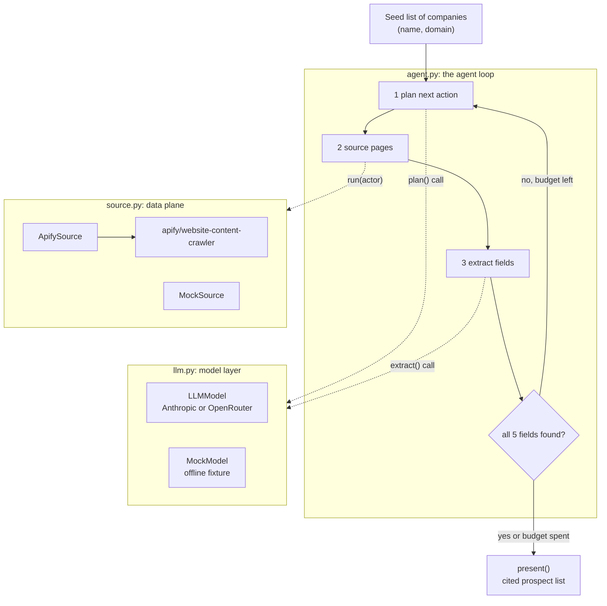

# web-agents-apify, Field Lab 01

Module 1 of The AI Runtime Field Lab 01, "A Reliability Layer for Web-Grounded
Agents." Apify is the data plane: the Actors and datasets that feed the agent.

Module 1 is the sourcing agent. Point it at a list of target companies and it
goes out, plans which Apify Actors to run, crawls public pages, and comes back
with a clean prospect list where every field traces to a source. The list looks
done.

Whether each value is actually true, fresh, and a real fit is the next question.
That reliability layer, the trust core and the eval, is module 2, built later.

Lab page: https://lab.theairuntime.com/01/

## What the agent does

For each company on the seed list it runs a loop:

1. **plan** the model picks which Apify Actor to run next, given what is missing
2. **source** that Actor pulls public pages through the data plane
3. **extract** the model pulls each rubric field with the exact snippet behind it
4. **iterate** if a field is still missing, it takes another sourcing action
5. **present** a prospect card per company, every field traced to a source

You can watch Quantal take a second action (the jobs board) to find a reason to
reach out that was not on its website.

## How it works

The agent alternates between thinking (LLM calls in `llm.py`) and acting (tool
calls in `source.py`), and `agent.py` only orchestrates. For the full walkthrough,
the prompts behind each LLM call, the Apify Actor calls, the data model, and the
design choices, read **[ARCHITECTURE.md](ARCHITECTURE.md)**. It is written as
learning material.

## What is here

- `ARCHITECTURE.md`   the full technical walkthrough and learning guide
- `rubric.md`   the customer frame: the five fields the agent sources to
- `agent.py`    the agent loop and the prospect-list output
- `llm.py`      the model layer: a live model (Anthropic or OpenRouter) or an offline mock
- `source.py`   the data plane: run Apify Actors, or replay the offline fixture
- `models.py`   the data model: Evidence, SourcedField, Prospect
- `smoke.py`    a thirty-second check that your Apify token works
- `fixtures/crawl_pages.json`   an offline crawl fixture so the agent runs with no keys
- `seeds.example.json`   real companies for a live run
- `requirements.txt`, `.env.example`

## Setup (VS Code terminal)

Open the VS Code integrated terminal with `Terminal > New Terminal`. Every
command is plain shell, so any terminal works the same way.

### 1. Clone the repo and open it in VS Code

    git clone https://github.com/ogkranthi/the-ai-runtime-lab
    cd the-ai-runtime-lab/web-agents-apify

In VS Code: `File > Open Folder`, pick `the-ai-runtime-lab`, then `cd
web-agents-apify` in the terminal.

### 2. Create the environment and install

    python -m venv .venv && source .venv/bin/activate
    pip install -r requirements.txt

On Windows, activate with `.venv\Scripts\activate` instead of the `source` line.

### 3. Add your keys (only needed for the live run)

    cp .env.example .env

Open `.env` in VS Code and paste your `APIFY_TOKEN`, plus a model key if you want
the live run. The offline run needs neither.

## Run the agent

    python agent.py

Runs the full loop over the seed list with the offline mock model and crawl
fixture, so it needs no keys. It prints the sourcing actions it took, then the
prospect list. Expected: four candidates, every field cited.

Run it live against real Apify Actors and a real model:

    python smoke.py            # first confirm the token: apify ok: SUCCEEDED
    python agent.py --live     # needs APIFY_TOKEN and a model key

In live mode the model plans the Actors and extracts from the crawled text.
Everything else is identical.

### Live mode needs real companies

The demo watchlist (Forge Labs, Quantal, and so on) is fictional. Those domains
exist only in the offline crawl fixture, so a live run against them finds nothing
and every field comes back "not found". That is the agent being honest: no public
source, no value.

For a live run, point the agent at real companies. `--live` defaults to the four
real companies in `seeds.example.json`. To use your own watchlist, pass a JSON
file of `{"company", "domain"}` objects:

    python agent.py --live --seeds my_targets.json

Live extraction depends on what each site actually publishes, so expect some
fields to come back "not found". The banner reports honestly how many of the
possible fields were sourced and cited.

## Environment variables

- `APIFY_TOKEN` runs the live Apify Actors.
- `ANTHROPIC_API_KEY` or `OPENROUTER_API_KEY` drives the live agent: the model
  plans Actors and extracts fields. Pick one provider, you do not need both.

The offline run (`python agent.py`) needs none of them. All keys live in `.env`,
never in the code.

## The one rule this agent follows

Every field the agent returns carries its evidence: the source URL, the exact
snippet it came from, and a `fetched_at` timestamp. Plausible is not verified. A
field with no source is a missing field, not a value.

That last line is the whole setup for module 2. The agent here produces a list
that looks done. Module 2 builds the trust core that decides which of it is
actually safe to act on.
