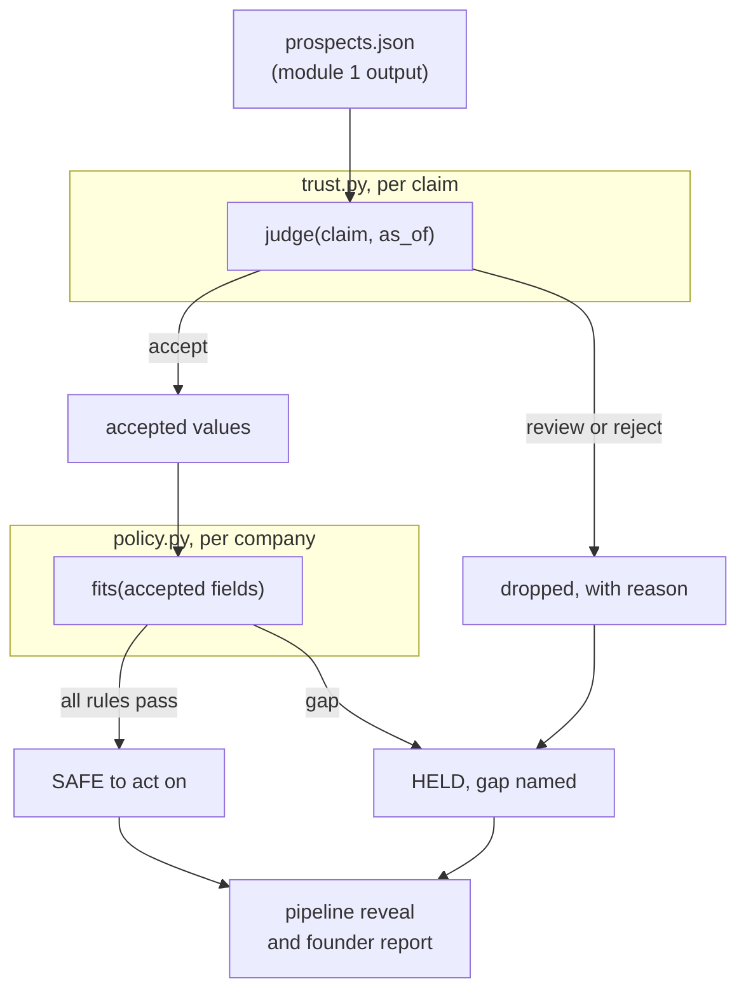
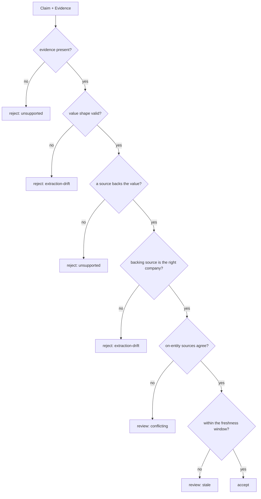
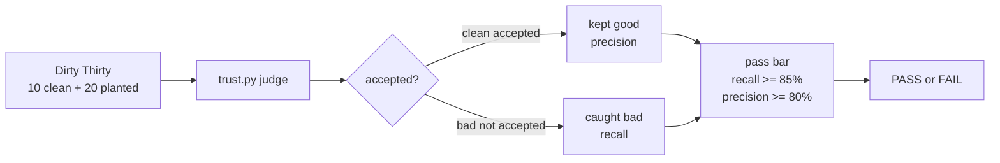

# Architecture and learning guide, module 2

This document explains the reliability layer: how it reads module 1's prospect
list, decides which values are true and supported, applies the fit rubric, and
proves the whole thing works against a planted trap set. It is written to be read
alongside the code, and every claim points at a real file.

If you only read one thing: module 1 produced a list that looks done. Module 2
asks, of every cited value, "is this actually true, fresh, and about the right
company?" and hands back only what survives, with a reason on everything it drops.

Contents:

1. [Why this layer exists](#1-why-this-layer-exists)
2. [The pipeline](#2-the-pipeline)
3. [The trust core, claim by claim](#3-the-trust-core-claim-by-claim)
4. [The four breaks and how each is caught](#4-the-four-breaks-and-how-each-is-caught)
5. [The policy filter](#5-the-policy-filter)
6. [The eval and the Dirty Thirty](#6-the-eval-and-the-dirty-thirty)
7. [Why trust and policy stay apart](#7-why-trust-and-policy-stay-apart)
8. [Determinism, and why it matters here](#8-determinism-and-why-it-matters-here)
9. [Glossary](#9-glossary)

---

## 1. Why this layer exists

A web-grounded agent returns a clean list. The list is the problem. It looks
finished, so you act on it, and then a third of the emails bounce, two companies
shut down last year, and several were never a fit. The gap between a list that
looks done and a list you can act on is the entire subject of this lab.

Module 1 is deliberately credulous. It sources a value, cites it, and moves on.
It never asks whether the value is still true or whether two sources disagreed.
Module 2 is the skepticism. It is source-agnostic: hand it any claim and its
evidence and it returns a verdict. Lead generation is just the first use case;
the trust core works for any agent that makes claims off the web.

---

## 2. The pipeline

`pipeline.py` orchestrates. For each company it judges every claim through the
trust core, keeps only the accepted values, then runs the fit filter over what
survived. A company is safe only if every field it needs was both accepted by
trust and passed by policy.

| File | Job |
|------|-----|
| `trust.py` | Judge one claim and its evidence. The reusable artifact. |
| `policy.py` | Apply the fit rubric to accepted values. Fit, never truth. |
| `pipeline.py` | Wire the two over the prospect list and show the reveal. |
| `report.py` | Render the founder-facing Markdown trust report. |
| `eval.py` | Grade the trust core against the Dirty Thirty. |

The input, `fixtures/prospects.json`, is module 1's output: four companies, every
field carrying its `Evidence`. Two of them carry planted problems, which is what
makes the reveal land.

---

## 3. The trust core, claim by claim

The core is one function, `judge(claim, as_of)` in `trust.py`. It takes a single
`Claim` (a field, a value, a company, and a list of `Evidence`) and returns a
`Verdict` of accept, reject, or review, always with a reason and a trace.

Two design points carry the whole module:

- **It is source-agnostic.** It never imports the rubric, the company list, or
  anything about fit. It only knows about claims and evidence. That is what makes
  it reusable for any web-grounded agent, not just this one.
- **`as_of` is passed in, never read from the clock.** The same claim judged
  against the same `as_of` always gets the same verdict. That is what makes the
  eval reproducible and the freshness check testable.

The verdict carries a `trace`: the field, the company, the sources, the checks
run, and what was rejected and why. That trace is the observability output the
founder report reads.

---

## 4. The four breaks and how each is caught

The checks run in a fixed order, cheapest and most disqualifying first. The first
one that fails decides the verdict.

**Unsupported.** Two gates catch it. First, no evidence at all is an immediate
reject: a value with no source is a missing field, not a value. Second, the
`_supports()` helper checks that at least one source actually backs the value:
the snippet is not empty or walled, it claims the same value, and that value
appears in the snippet text. A confident value whose snippet does not contain it
is dropped. This is the same evidence rule module 1's grounding enforced, applied
again at judgment time.

**Extraction-drift.** Two forms. A value of the wrong shape for its field (a
headcount with no number) was grabbed from the wrong place; the `SHAPE_RULES`
check rejects it. And a value backed only by sources about a different company
(evidence about Bolt Mobility attached to Bolt Metrics) is rejected by the
entity-match check. The `entity` field on each `Evidence` is what makes this
possible.

**Conflicting.** Once a value is supported and on-entity, the core collects every
on-entity source's `claimed_value`. If they disagree (one says 120 employees,
another says 260), the verdict is review, not accept. You cannot stand behind a
number two sources contradict. This is exactly Helios in the sample run.

**Stale.** The freshest supporting source is compared to `as_of` against a
per-field window in `FRESHNESS_DAYS`. A reason to reach out goes stale in 90
days; a product category lasts two years. Evidence past its window is sent to
review with its age in the reason.

Why this order. Evidence presence and shape are the cheapest and most total
failures, so they go first. Support and entity establish that the value is real
and about the right company before the core bothers comparing sources or dates. A
claim only reaches accept by passing all six checks.

---

## 5. The policy filter

`policy.py` applies the fit rubric, and it runs on one input only: the values the
trust core already accepted. It never re-judges truth.

`fits(company, accepted)` checks each rubric rule: US-based, headcount 50 to 300,
a developer-facing product, an engineering-leader contact, and a real reason to
reach out. A missing field is a failed rule, never a pass. It returns a
`FitResult` with the company, whether it fits, and the exact list of gaps.

The key move is what counts as a gap. A field the trust core sent to review or
reject is simply absent from `accepted`, so policy treats it as missing. That is
why Helios fails on headcount: the value was not wrong to policy, it was never
accepted by trust, so policy never sees it. Truth and fit stay cleanly separated,
and the company degrades for an honest reason.

This is also why the layer degrades instead of padding. Policy hands back only
companies that clear every rule, and names the gap on the rest. A short list you
can stand behind beats a full list with junk in it.

---

## 6. The eval and the Dirty Thirty

A guard you cannot measure is a guard you cannot trust. `eval.py` grades the trust
core against `fixtures/dirty_thirty.json`: thirty frozen claims with known
answers, ten clean and twenty each planted with one specific break.

The core is graded on two numbers, not one:

- **Bad-record recall**: of the twenty planted records, the share the guard did
  not accept. Did it catch the bad?
- **Clean-record precision**: of the records it accepted, the share that are
  actually clean. Did it keep the good?

Two numbers, because either one alone is gameable. A guard that rejects
everything scores perfect recall and fails precision. A guard that accepts
everything scores perfect precision and fails recall. Only catching the bad while
keeping the good passes both. The pass bar also requires 100 percent evidence
coverage on accepted records, zero unsupported accepted claims, and a reason on
every rejection. Current result: PASS, 20 of 20 bad caught, 10 of 10 clean kept.

The records are frozen and `as_of` is fixed, so the eval is fully reproducible. A
change to `trust.py` that breaks a case shows up immediately as a record whose
verdict no longer matches its expected answer.

---

## 7. Why trust and policy stay apart

The lab's one architectural rule: the trust core decides truth, the policy filter
decides fit, and they never mix.

The trust core is the reusable artifact. It knows nothing about design partners,
headcount bands, or developer tools. Hand it a medical claim, a financial figure,
or a news fact with its evidence and it works the same way. The fit logic is
specific to this founder's profile and changes per use case. If fit logic leaked
into the core (say, rejecting a true headcount because it is out of range), the
core would stop being a truth detector and start being a this-week's-rubric
detector, and it would rot. Keeping them apart is what lets the trust core
outlive the lead-gen use case it was born in.

---

## 8. Determinism, and why it matters here

Module 1's agent uses an LLM and varies between runs. Module 2 is deterministic
on purpose. The trust core is plain rules over evidence metadata: presence, shape,
text support, entity match, source agreement, and dates. No model call, no
randomness, `as_of` passed in.

This is a deliberate split. The judgment of whether a claim is supported should
not itself drift between runs, or the eval would measure noise. A deterministic
core gives you a number you can put in a report and reproduce tomorrow. It is
also faster, free, and runnable with no keys. A model-backed judge is possible
and sometimes useful, but the reproducible safe-to-act number is the artifact,
and that wants determinism.

---

## 9. Glossary

- **Claim**: one field's value about a company, plus every source for it.
- **Evidence**: the source URL, snippet, timestamp, claimed value, and entity
  behind one source.
- **Verdict**: the trust core's answer for one claim: accept, reject, or review,
  with a reason and a trace.
- **Trust core**: the source-agnostic function that decides if a claim is true
  and supported right now.
- **Policy filter**: the fit rules, applied only to accepted values.
- **Recall**: of the bad records, the share the guard caught.
- **Precision**: of the accepted records, the share that are actually clean.
- **Dirty Thirty**: the frozen trap set of thirty claims used to grade the core.
- **as_of**: the reference date the core judges freshness against, passed in so
  runs are reproducible.
